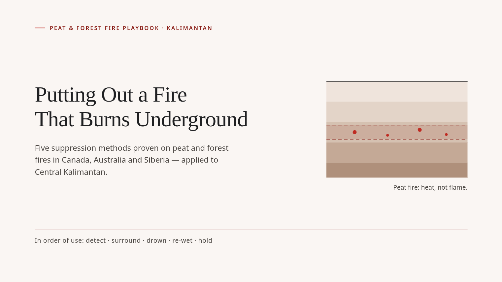
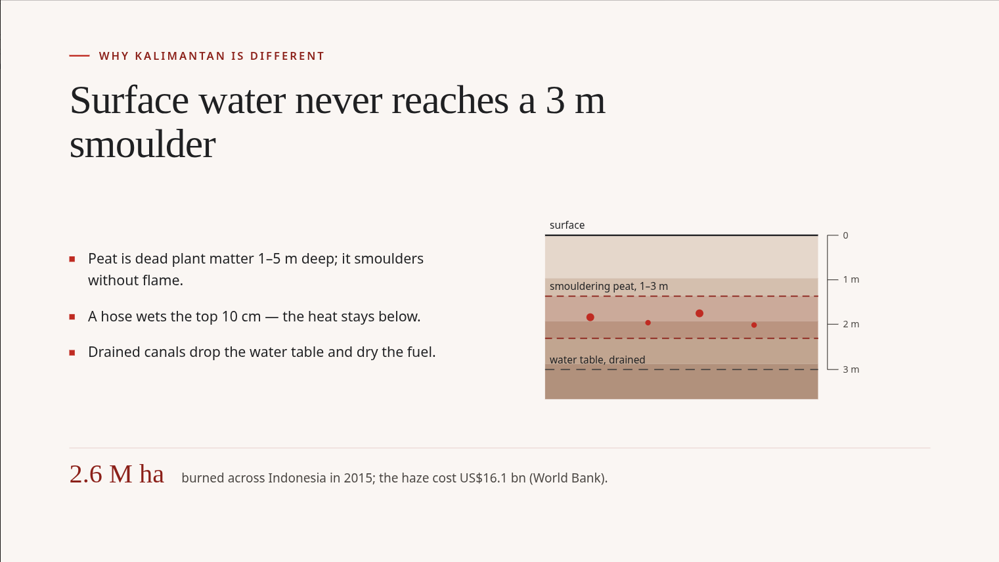
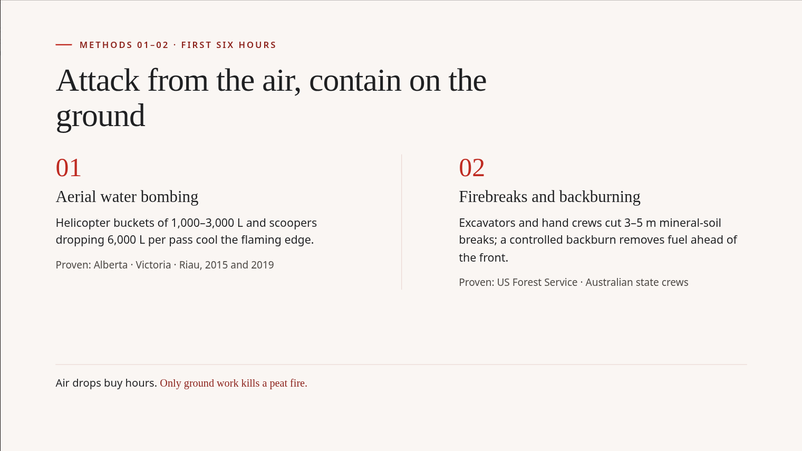
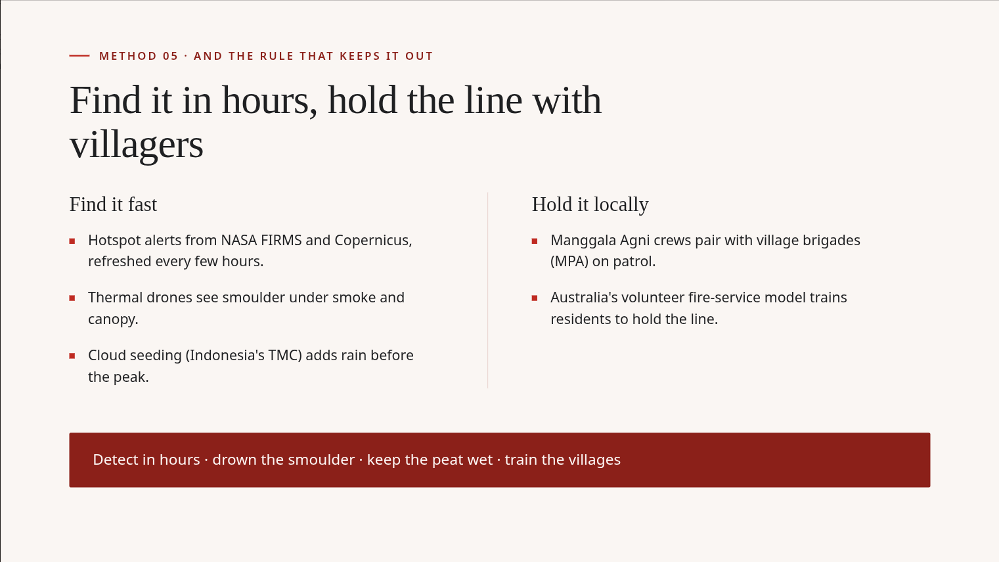

# slidegen

Generate presentation decks as standalone 16:9 HTML slides from a single text brief, using any OpenAI-compatible LLM endpoint.

No build step, no framework, no runtime dependencies — one Node script plus a static page.

> **⚠ Work in progress** — this project is actively evolving and has rough edges (features still being built). Contributions are very welcome: bug reports, feature ideas, design-system presets, docs — see [Contributing](#contributing).

## Why this exists

My wife needed to create slides for her study. AI slide tools helped, but on
free accounts they're heavily limited — generations cut off mid-deck and she
couldn't finish her slides. Meanwhile I already pay for an AI subscription
with a coding-model gateway, and she could happily use my key for it —
but the tools built around such subscriptions are developer tools:
installing one means giving it permission to do things on her laptop, and
driving a general-purpose AI agent is confusing when all she wants is
slides. And the last thing either of us wanted was another subscription.

So I built the UI she was missing, and just handed her the key: she describes
the deck in one plain sentence, and slidegen turns it into a complete,
self-contained HTML presentation — every slide generated in one pass,
previewed immediately, and editable slide by slide.

- **One suggestion → a finished deck** — a brief in, complete HTML slides
  out, no piecemeal generation limits.
- **A UI that does only slides** — no agent permissions on the laptop, no
  terminal, nothing to install; a laptop browser is all she needs.
- **Bring-your-own key, one bill** — point it at any OpenAI-compatible
  endpoint; no new subscriptions, no vendor lock-in.

In short: a focused UI instead of a general tool — she opens one web page,
types one sentence, and gets slides.

## Example output

A deck generated from this one-sentence brief (red/white theme requested in the prompt, beyond the editorial design system):

> Create 5 slides on how to put out the fire in Kalimantan wildfire, use proven method that is widely used around the world for similar situation. Slide must be in red and white theme.

| | |
|---|---|
|  |  |
|  |  |
|  | |

The full generated file is checked in at [`sample/deck.html`](sample/deck.html) — open it directly in a browser to see the deck in motion.

## Features

- **Brief → deck** — describe the presentation in plain language; the model returns a self-contained HTML deck (fixed 1280×720 stage per slide).
- **Resumable queue** — generations run server-side, one at a time, decoupled from the browser. Refreshing the page reattaches to the in-flight job instead of losing it; decks already saved to `output/` survive a server restart.
- **Design systems** — curated system prompts (Swiss International and others, see `design/systems.js`) enforce consistent visuals; more can be added in one file.
- **Slide editor** — restyle or rewrite any single slide ("make this less dense", "add an example"), or insert/delete/reorder slides. Edits are prompted with the surrounding deck for context so results stay visually coherent.
- **Render-based audit** — decks are rendered in headless Chromium and checked for real geometry violations (overflow, tight margins) on the 1280×720 stage; violations are reported to the UI and retried automatically.
- **Content fidelity checks** — token-overlap comparison ensures a fix pass doesn't silently discard the target slide's facts and an insert isn't a near-duplicate of a sibling slide.
- **Streaming with watchdogs** — idle timeout (default 120 s) catches stalled providers; a hard total cap (default 15 min) bounds every generation.
- **History** — decks are auto-saved to `output/<timestamp>/deck.html` (server) and per-browser in `localStorage`, so nothing is lost on refresh.
- **PDF export** — one PDF page per slide, exactly 1280×720, via headless Chromium.

## Requirements

- Node.js ≥ 24 (uses `require` + global `fetch`; only dev-time dependency is `puppeteer-core` for audit/PDF, which is optional)
- Chromium-based browser for the audit and PDF export features (bundled in the Docker image; skipped gracefully when absent)

## Tested with

Verified working end-to-end (deck generation, slide editing, deck rendering — results in the [example above](#example-output)) against OpenAI-compatible endpoints via [OpenCode](https://opencode.ai), these models:

- `mimo-v2.5`
- `deepseek v4.1 flash`

Other models/endpoint combinations generally work whenever the endpoint honors the standard chat-completions dialect, but slide quality varies by model naturally.

## Quick start

```sh
npm install            # optional — only puppeteer-core, for audit + PDF export
SLIDEGEN_API_KEY=sk-... node server.js
# open http://localhost:3000
```

Or configure everything in the web UI's ⚙ Settings (base URL, API key, model, custom headers) — the key is kept in your browser's `localStorage` and never persisted server-side.

### Docker

```sh
SLIDEGEN_API_KEY=sk-... docker compose up --build
# open http://localhost:3000
```

During development, `docker-compose.override.yml` bind-mounts the source and runs
`node --watch server.js`, so edits to `server.js`, `audit.js`, or `design/` reload
automatically — no rebuild needed (rebuild only when `package.json` or the
Dockerfile changes). If an edit doesn't take effect the watcher missed it; run
`docker restart slidegen-slidegen-1`.

## Configuration

Env vars are fallbacks; anything set in the web UI overrides them.

| Variable | Default | Description |
|---|---|---|
| `SLIDEGEN_API_KEY` | *(none — required)* | API key for your provider. Also accepted per-request from the UI. |
| `SLIDEGEN_BASE_URL` | `https://api.openai.com/v1` | Any OpenAI-compatible base URL (vLLM, Ollama, OpenRouter, …). |
| `SLIDEGEN_MODEL` | `gpt-4o-mini` | Model name as it appears in `GET /models`. |
| `PORT` | `3000` | HTTP port. |
| `SLIDEGEN_IDLE_TIMEOUT_MS` | `120000` | Abort generation when nothing arrives from the provider for this long. |
| `SLIDEGEN_TIMEOUT_MS` | `900000` | Hard cap for one generation regardless of progress. |
| `SLIDEGEN_CHROME` | *(auto-detected)* | Path to the Chromium executable used by the audit/PDF. Falls back to common paths (`/usr/bin/chromium`, `chromium-browser`, `google-chrome`). |
| `SLIDEGEN_OUTPUT_DIR` | `./output` | Directory for auto-saved decks and exported PDFs. |

## How it works

```
browser (public/)          server.js                    your provider
────────────────           ─────────                    ─────────────
brief + settings ────POST /generate────►  queue (one at a time) ──► POST <base>/chat/completions
                                              │                         (streamed, SSE)
poll GET /generate/:id ◄── job state ─────────┤
deck preview ◄─────────── "done"              ▼
                                           headless Chromium
                                           geometry audit (audit.js)
```

- `POST /generate` — enqueue a full-deck generation; returns a job id.
- `GET /generate/:id` — job status (phase, progress, and the deck when done); used to reattach after a refresh.
- `POST /generate/:id/cancel` — cancel a queued or running job.
- `POST /edit` — single-slide replace/insert with retry passes: scoped-CSS check, fidelity check, render-audit.
- `POST /models` — lists models from the provider (shape-tolerant across providers).
- `POST /save` — persists the current deck to `output/`.
- `POST /export` — PDF export (container only, also written to `output/pdf/`).

## Project layout

```
server.js       HTTP server, provider proxy, streaming, edit pipeline, persistence
audit.js        Headless-Chromium geometry audit and PDF export
design/systems.js  Design-system and editor system prompts
public/         Browser UI (no build step — plain ES modules served as-is)
output/         Auto-saved decks (git-ignored)
```

## Security notes

- Credentials are only held in browser `localStorage` or your environment; they are proxied per-request and never stored or logged by the server.
- The web UI runs the generated deck in a sandboxed iframe; static file access is confined to `public/`.
- Keep your API key scoped to trusted hosts — the key travels from your browser through this server to the provider URL you configured.

## Contributing

This is a side project built for real household use and shipped in that spirit — WIP, unpolished in places, but working. If any of the above is interesting to you, contributions are welcome:

- Open an issue for bugs, ideas, or rough UX spots (a screenshot or the failing deck HTML helps a lot).
- Design-system presets (`design/systems.js`) are a great low-barrier first contribution: one object with prompt text, no app code changes.
- PRs: keep the zero-dependency spirit (stdlib + browser-native first), keep diffs small, and match the plain-JS style of the existing code.

### Development

```sh
npm install
node --watch server.js    # reload on change
# or: node server.js      # plain start, http://localhost:3000
```

`public/` is static — no build step; refresh after edits. The headless-Chromium audit (`audit.js`) is optional in dev; the app degrades gracefully when it's unavailable.

### Tests

```sh
npm test        # node:test — pure unit tests plus an HTTP integration test
```

Tests use Node's built-in test runner (no dependencies) and need neither a provider key nor a browser: the HTTP test streams a canned deck from a local fake provider. Generated decks are written to a temp dir via `SLIDEGEN_OUTPUT_DIR`, so the repo's `output/` is untouched.

## License

MIT — see [LICENSE](LICENSE).
